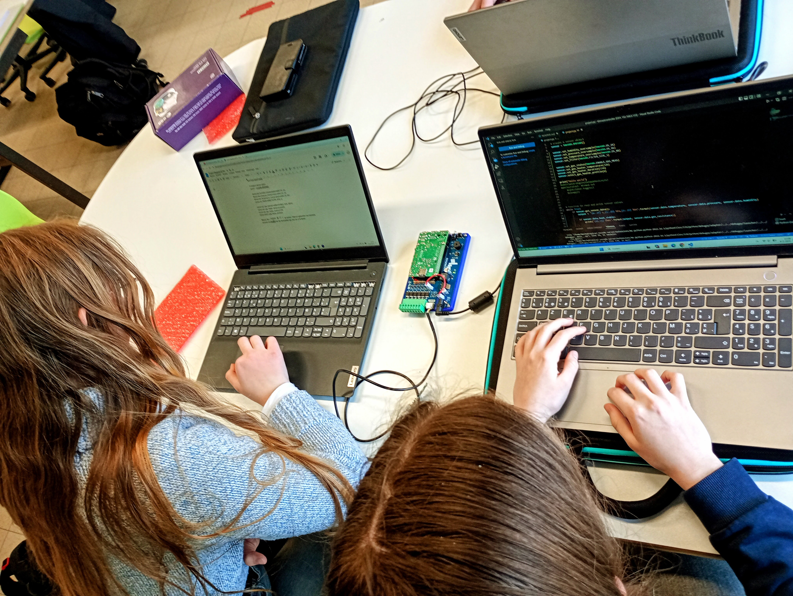

Dit is de GitHub-organisatie van de opleiding Mechatronica aan **GO! Campus De Vesten** in Herentals. Hier delen we onze projecten, code en documentatie rond automatisatie, robotica, embedded systemen en meer.

#### Wat je hier vindt
- Projecten van leerlingen uit de tweede en derde graad
- Samenwerkingen met bedrijven en STEM-initiatieven
- Openbare repositories met Arduino-, Python- en PLC-code
- Handleidingen, schema’s en technische documentatie

 

## Resources
Op de `resources` pagina kan je allerlei hulpmiddelen vinden die je kunnen helpen met je project!

[Resources](../documentation/resources.md)